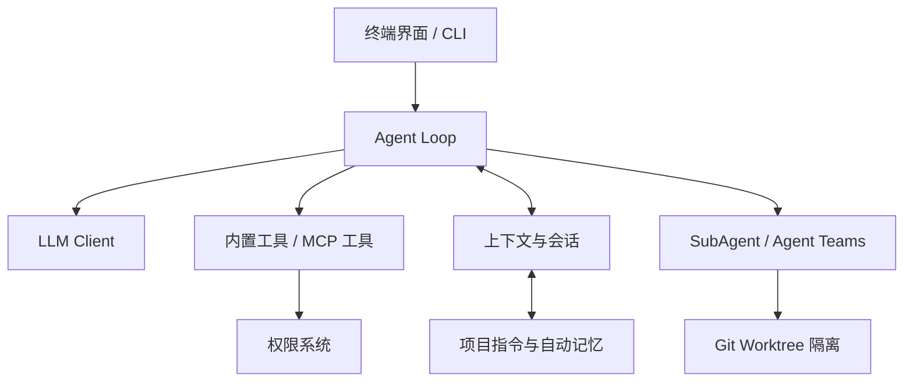

# MyCoding：从终端 AI 助手到多 Agent 编程团队

> 一个用自然语言驱动的终端 AI 编程助手：让模型在权限约束下读代码、改文件、跑命令，并在需要时组织多个 Agent 协作完成复杂任务。https://github.com/Qinanb/MyCoding-Agent

很多人第一次接触 AI 编程工具时，都会产生同一个疑问：它为什么能“自己干活”？

表面上看，AI Coding Agent 只是一个更聪明的聊天窗口；但当你让它“帮我梳理这个仓库，再重构一个模块并跑测试”时，它实际上需要不断理解当前状态、选择工具、执行操作、根据结果调整下一步。要把这套流程做得可用，光有一个大模型远远不够。

MyCoding 是我围绕这个问题实现的终端 AI 编程助手。它不是试图复刻某一个现成产品，而是希望把 Coding Agent 拆开：模型如何做决策、工具如何提供能力、安全边界如何生效、上下文如何控制成本，以及多个 Agent 如何避免互相踩文件。

这篇文章记录它从一个能对话的原型，逐步演变为具备工具调用、权限控制、上下文管理、记忆、MCP 扩展和多 Agent 协作能力的过程。

## 从“会聊天”到“能完成任务”

最早的版本只做了一件事：接入 LLM API，让模型在终端里流式回复。它可以多轮对话，但本质上仍然是聊天机器人——它不知道工作目录里有什么，也无法改变任何东西。

让系统真正成为 Agent 的关键，是补齐下面四个要素：

1. **LLM**：理解用户目标，并决定下一步动作；
2. **工具**：读取文件、搜索代码、编辑文件、执行命令等实际能力；
3. **循环**：一次工具调用结束后，不立即终止，而是把结果交还给模型继续推理；
4. **反馈**：工具执行成功、失败和输出内容都会影响下一步决策。

核心循环并不复杂：模型返回工具调用，系统执行后将结果写回会话；如果模型仍要求调用工具，就继续下一轮；直到模型给出最终回答或触发停止条件。

```text
用户任务
  ↓
模型推理 → 是否调用工具？ ──否──→ 返回结果
  ↓ 是
执行工具 → 收集结果 → 写回对话
  └───────────────────────→ 下一轮模型推理
```

这个循环让 MyCoding 从“回答问题”变成“完成任务”。例如面对“找出项目中所有旧包名并改成新名称”的请求，模型可以先搜索、再修改、然后运行测试验证，而不是仅给出操作建议。

## 架构不是一次设计出来的

MyCoding 的架构并不是一开始就规划成完整的五层。大多数模块都是在解决上一个版本暴露的问题时加入的。



从职责上看，可以将项目划分为五层：

- **交互层**：终端 UI、命令、配置和 Skill，为用户提供入口；
- **引擎层**：LLM 客户端、Agent Loop 和任务编排，负责“思考与调度”；
- **工具层**：文件、命令、搜索等内置工具，以及通过 MCP 接入的外部能力；
- **记忆层**：上下文压缩、会话持久化、项目指令和自动记忆；
- **安全层**：权限检查、规则匹配、路径限制与人工确认，贯穿每一次工具调用。

分层的价值不只是代码目录更整齐。比如新增 MCP 时，不需要改 Agent Loop；增加 Hook 时，也不必让工具实现感知 UI 的存在。每层通过清晰的数据和事件边界协作，后续扩展成本会低得多。

## 能执行命令的 Agent，必须先学会刹车

一旦 Agent 可以执行 Bash 命令、覆盖文件或创建目录，安全就不再是“以后再做”的功能。模型可能误解用户意图，也可能被仓库中的恶意文本诱导执行危险操作。

MyCoding 没有把安全寄托在“模型应该足够聪明”上，而是将其实现为独立的多层防线：

1. **危险命令检测**：拦截已知高风险命令模式；
2. **路径沙箱**：限制可读写范围，并处理符号链接逃逸风险；
3. **规则引擎**：支持用户、项目和本地三级规则，精确匹配工具及参数；
4. **权限模式**：区分默认模式、自动接受编辑、规划模式和完全放行模式；
5. **HITL 确认**：对于需要确认的操作，暂停 Agent Loop，由用户做最后决定。

这里有一个很重要的原则：**模型负责提出动作，系统负责决定动作是否可以执行。** 无论模型如何组织参数，只要路径、规则或权限模式不允许，工具调用就不会真正落地。

## 上下文窗口变大后，为什么还要压缩？

Agent 在复杂任务里可能连续调用几十轮模型。每一轮都携带完整历史会话，会带来两个问题：成本持续上升，且大量过期的工具输出会分散模型注意力。

MyCoding 使用两层策略管理上下文：

- **大结果落盘**：当工具输出过长时，将完整内容写入项目内的临时上下文文件，对话中只保留路径与摘要。模型真正需要时，再通过读取工具获取原文。
- **自动摘要压缩**：当历史接近上下文预算时，将早期对话压缩为结构化摘要，同时保留最近且仍然相关的消息。

此外，用户可以通过 `/compact` 主动压缩对话。它解决的不是“上下文能不能塞下”，而是“哪些信息真的值得带到下一轮”。

## 记忆：把固定规则、会话和经验分开

“记忆”很容易被误解成把所有聊天记录塞回 Prompt。实际这样做通常只会让上下文越来越嘈杂。

MyCoding 把长期信息分成三类：

- **项目指令**：根目录的 `MYCODING.md` 会在会话启动时加载，适合存放代码规范、架构约束和协作约定；
- **会话记录**：`.mycoding/sessions/` 以 JSONL 保存对话与工具调用过程，用于恢复中断的工作；
- **自动记忆**：`.mycoding/memory/` 通过 `MEMORY.md` 索引独立主题文件，保存用户偏好、项目事实或反复出现的经验。

这样，固定规则始终可见，完整过程可恢复，而与当前任务无关的历史又不会无差别进入每次模型请求。

## MCP、Skill 与 Hook：把系统能力变成可插拔模块

一个 Coding Agent 不应把所有能力硬编码在核心里。MyCoding 用三种扩展机制处理不同层面的定制需求：

- **MCP**：将数据库、文档搜索、外部 API 等服务以标准工具协议接入；
- **Skill**：用 Markdown 与 frontmatter 描述可复用的任务流程和工具范围；
- **Hook**：在工具调用前后、会话开始结束等生命周期节点自动执行检查、提示或脚本。

三者的边界不同：MCP 扩展“能做什么”，Skill 扩展“如何完成一类任务”，Hook 扩展“什么时候自动发生”。把它们拆开，既避免核心膨胀，也能让不同项目按需组合能力。

## 单个 Agent 不够时，如何组成团队？

单个 Agent 处理大型任务时，常见瓶颈不是模型不够强，而是上下文污染和文件冲突。为此，MyCoding 逐步引入了 SubAgent、Worktree 和 Agent Teams。

SubAgent 为子任务提供独立上下文，避免一个任务的中间细节干扰另一个任务。再进一步，Git Worktree 为每个执行者提供独立工作目录：多个 Agent 可以并行修改不同模块，而不直接抢同一份工作区。

在团队模式下，Lead 负责拆解任务和协调，队员共享任务列表，并通过消息机制交换发现和进展。对于复杂任务，Lead 还可以进入 Coordinator Mode，专注调度而不直接修改代码。

这套设计背后仍是同一个思路：**隔离上下文、隔离文件系统、建立受控通信。** 多 Agent 的关键不是“多开几个模型”，而是让它们的协作成本低于并行带来的收益。

## 当前边界与下一步

MyCoding 目前是一个面向学习、验证架构和持续迭代的个人项目，而不是已经具备完整商业化能力的产品。它还可以继续改进：

- 为工具调用、模型请求、上下文压缩和多 Agent 调度补充更完整的可观测性；
- 提升长任务的流式进度反馈，让用户更容易理解 Agent 正在做什么；
- 改进多 Agent 的冲突检测与合并工作流；
- 持续完善权限策略和对不可信仓库内容的防护；
- 将检索、评测和成本统计沉淀为可重复运行的工程能力。

不过，这个项目最重要的收获并不是“又做了一个 AI 工具”，而是把 Coding Agent 的关键问题拆开并亲手验证：模型只负责推理，工具提供能力，循环让任务继续，反馈驱动下一步；而安全、上下文、记忆和协作，决定了它能否从一个有趣的 Demo 变成真正可用的系统。

如果你也在学习 Agent，不妨从一个最小循环开始：接上模型、给它一个工具、把结果喂回去。剩下的架构，往往会在你不断解决真实问题的过程中自然长出来。
