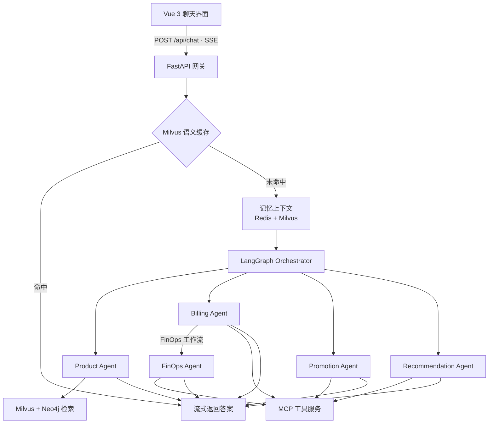

---

title: CloudAgent
published: 2026-08-30
description: 一个多Agent协同服务平台
image: ./could.png
tags: [Python, Agent]
category: 锻造台
draft: false
pinned: true

---

# CloudAgent：用多 Agent 架构重构云平台智能客服

> 项目仓库：https://github.com/Qinanb/Cloud-Agent

当客服问题从“查一条知识库”变成**帮我选配置、查账单、判断资源是否闲置、再生成一份推广素材**时，单一问答机器人会同时承担理解意图、检索知识、业务决策、外部执行多重任务，业务逻辑混杂在一起，不仅维护成本高，还容易出现回答幻觉、越权访问、响应慢等问题。CloudAgent 是面向云计算业务场景设计的企业级多Agent智能客服平台，将不同业务能力拆分为独立专属Agent，依托状态机编排、分层记忆、混合检索、MCP标准化工具协议，构建一套可落地、可观测、安全可控的智能客服系统。

## 想解决什么问题？

云平台客服的用户提问往往是多轮连续复杂对话，举个典型对话例子：

> “我有一套 Java + MySQL 服务，预算有限，该选什么实例？” “那我现在的机器里有没有可以降配的？顺便把推荐链接发给我。”

这类对话包含意图理解、知识库查阅、访问用户私有业务数据、调用外部业务系统完成操作多重工作。传统单一大模型客服方案会遇到如下痛点：

1. 路由逻辑、业务Prompt全部耦合在一起，新增业务能力迭代困难；
2. 退款规则、计费说明等高频标准问题每次都走大模型推理，响应延迟高，Token成本巨大；
3. 单纯向量RAG面对实例规格、地域限制、产品依赖这类网状关联数据，极易产生参数幻觉；
4. 大模型工具调用参数可控性弱，存在Prompt注入诱导越权查询他人账单、实例数据的安全风险；
5. 长周期多轮对话缺少记忆继承，用户需要反复复述业务背景，体验差。

CloudAgent 的核心思路不是把单个Agent调得更聪明，而是**任务拆分，各司其职**：将合适的问题交给对应领域Agent处理，给每个Agent配置最小权限的工具与数据源约束，通过统一调度串联完整业务流程。

## 技术栈

| 分类      | 技术组件                                                     |
| --------- | ------------------------------------------------------------ |
| 后端服务  | Python、FastAPI（REST API / SSE流式响应）                    |
| Agent编排 | LangGraph、LangChain、DashScope / Qwen大模型                 |
| 存储组件  | Milvus（向量检索、语义缓存、长期偏好记忆）、Neo4j（知识图谱）、Redis（会话短期记忆）、MySQL（订单、实例、监控业务数据） |
| 工具协议  | MCP / FastMCP 底层服务标准化解耦协议                         |
| 前端      | Vue3 + TypeScript + Vite                                     |

## 总体设计：接入、编排、记忆与工具四层协作

整体架构分为四层：**接入层、编排层、记忆层、工具层**。



- **接入层**：Vue3前端聊天页面，FastAPI网关提供SSE流式接口，网关前置Milvus语义缓存作为第一道流量拦截；
- **编排层**：基于LangGraph`StateGraph`状态机实现多Agent协同，通过`AgentState`全局状态总线共享`user_id`、`session_id`、`memory_context`、`next_agent`等上下文，利用条件边完成动态任务分发；
- **记忆层**：实现**Redis短期会话记忆 + Milvus用户长期偏好记忆**分层记忆体系，会话启动前组装记忆上下文注入Agent状态；会话结束后异步抽取用户偏好存入向量库；
- **工具层**：包含Milvus+Neo4j混合检索工具、FastMCP工具服务，把数据库查询、外部API调用、AI绘图等异构能力封装成标准化可调用工具。

## 核心模块设计详解

### 1. 多Agent编排：Orchestrator调度 + 领域专家Agent矩阵

系统采用**总控路由Agent + 多个垂直领域专家Agent**架构，Orchestrator本身不生成业务回答，仅结合用户query和记忆上下文做意图判断，分发任务给子Agent，实现工具最小授权，隔离数据访问权限。

| Agent角色           | 核心职责                                   | 挂载工具                                                 |
| ------------------- | ------------------------------------------ | -------------------------------------------------------- |
| Orchestrator        | 意图路由、指代消解，决定流转到哪个子Agent  | 无业务工具，仅读取全局状态                               |
| ProductAgent        | 云产品概念、规格参数、政策FAQ咨询          | Milvus向量检索、Neo4j图谱检索                            |
| BillingAgent        | 查询用户私有订单、实例、账单明细           | FastMCP（订单/实例查询工具），带UserIdInjector越权拦截器 |
| RecommendationAgent | 根据业务场景做云产品选型推荐               | MCP商品目录工具、向量检索、推广素材生成工具              |
| FinOpsAgent         | 读取监控指标，分析闲置资源输出降本优化方案 | MCP实例监控指标查询工具                                  |

> 安全设计：`UserIdInjector`拦截器，在LangGraph节点调用工具时强制从状态注入真实`user_id`，无视大模型传入的伪造用户ID，抵御Prompt注入带来的越权查库风险。

### 2. 网关层L1/L2双层Milvus语义缓存

大量客服问题是重复标准FAQ（退款规则、备案流程、计费规则等），没必要每次都进入Agent完整推理链路。在FastAPI网关层实现双层语义缓存：

1. **L1精确命中**：问题规范化字符串完全匹配，直接返回缓存答案；
2. **L2语义命中**：对用户query做Embedding向量化，Milvus向量检索，余弦距离≤0.08高置信度时，直接复用缓存结果；
3. 缓存未命中，才放行进入记忆组装与LangGraph Agent推理流程。

**收益**：高频问题首字响应从3.2s下降至80ms，大幅削减大模型Token消耗。

### 3. Hybrid RAG 图向量混合检索，抑制模型幻觉

云平台知识分为两类：

- 长文本文档、FAQ、最佳实践：适合Milvus向量语义检索；
- 实例规格、地域支持、产品依赖这类网状关联结构化数据：适合Neo4j知识图谱Cypher查询。

ProductAgent并行调用两套检索链路；同时做容错兜底：

> 当大模型生成的Cypher语法错误、执行无结果时，自动降级为图谱节点关键词模糊搜索，避免查询异常导致回答失效。

强制约束大模型输出必须带上检索来源文档，禁止编造参数，显著降低架构选型场景的幻觉问题。

### 4. Redis + Milvus 分层记忆系统

不把全部历史对话无脑塞进Prompt，避免上下文窗口无限膨胀。

- **短期记忆(Redis)**：保存当前会话对话，滑动窗口压缩，超过阈值自动裁剪，防止上下文溢出；
- **长期记忆(Milvus)**：会话结束后异步调用LLM抽取用户业务偏好（如“偏好高可用架构”、“预算敏感”），向量化存入Milvus；
- 会话开始时，MemoryManager组件合并短期对话历史+相关长期偏好，组装`memory_context`注入Agent全局状态，实现跨会话理解用户需求，减少用户重复描述背景。

### 5. FastMCP标准化工具协议，解耦业务系统

传统Function‑Calling硬编码，业务数据库、外部API逻辑和Agent代码高度耦合。项目使用FastMCP协议，将底层能力封装为独立MCP Server。

- 业务能力：订单实例查询、监控指标读取、商品目录查询、DashScope文生图生成推广海报&返佣链接；
- Agent作为MCP Client，通过标准协议调用工具，不需要感知底层MySQL、外部API实现细节；
- 新增业务工具仅需要开发注册MCP服务，不需要修改Agent核心逻辑，研发联调从天级缩短到小时级；
- 配合UserIdInjector拦截器，对私有业务数据访问做身份强制绑定，实现安全隔离。

## 项目成果指标

- LangGraph多Agent意图路由准确率 **95%+**，消除跨会话重复提问；
- Milvus+Neo4j混合检索，复杂产品参数召回准确率从60%提升至92%，有效抑制模型幻觉；
- L1语义缓存高频请求命中率38%，命中场景首字响应80ms，每月节省40%大模型Token开销；
- FinOps降本场景，资源优化分析耗时由人工45分钟缩短至15秒以内，优化建议采纳率>60%；
- 分层记忆系统，用户重复陈述背景轮次减少45%，用户满意度CSAT提升18%；
- FastMCP工具化改造，新增工具开发联调效率提升60%。

## 目录结构

```
.
├── agent/                     # Agent、工作流、记忆、检索与 MCP 服务
│   ├── agents/                # Orchestrator 与各领域 Agent
│   ├── core/                  # LangGraph 工作流、记忆、图谱与 MCP 管理
│   ├── mcp_servers/           # FastMCP 云平台工具服务
│   ├── tools/                 # Milvus / Neo4j 检索工具
│   ├── database/init_mock_data.sql # 订单、实例与指标模拟数据
│   ├── .env.example           # 环境变量示例
│   └── requirements.txt
├── app/                       # FastAPI API、缓存与聊天服务
├── front/cloud_agent/          # Vue 3 前端聊天界面
└── mock_data/                 # 产品、账单、网络安全等知识库样例
```

## MCP工具能力清单

`agent/mcp_servers/cloud_platform_server.py`实现的工具：

| 分类       | 工具名称                                                     |
| ---------- | ------------------------------------------------------------ |
| 商品与推荐 | `get_promotable_products`、`search_product_catalog`、`get_promotion_materials` |
| 营销素材   | `generate_ai_poster`                                         |
| 订单与资源 | `query_user_orders`、`query_user_instances`                  |
| FinOps分析 | `analyze_instance_usage`                                     |

MCP Client配置文件：`agent/config/mcp_servers.json`

## 后续优化方向

1. 完善全链路可观测性：统计缓存命中率、各节点耗时、工具调用成功率、降级回退原因，埋点日志体系；
2. 替换模拟mock数据为真实业务数据源，完善鉴权、审计、敏感信息脱敏；
3. 构建标准化评测数据集，对路由准确率、检索召回质量、端到端任务完成率做自动化评测；
4. 优化记忆抽取策略，过滤无效记忆，减少记忆膨胀带来的干扰。

## 总结

CloudAgent设计思想：**大模型负责理解与协调，系统稳定性交给状态机、缓存、检索、分层记忆、受控工具共同承担**。把能力边界做清晰，智能客服才能从Demo原型，进化成可以处理真实复杂业务流程的生产级平台。

> 提示：文档中的性能指标为方案验证目标，实际运行效果取决于模型质量、数据质量、索引参数、部署环境。