# 微信智能客服机器人

## 介绍

**主要工具**：[[Miloto]](https://github.com/hanqey/miloto)、[AstrBot](https://astrbot.app/)、[WeFlow](https://github.com/hicccc77/WeFlow)、微信、[RAGFlow](https://github.com/infiniflow/ragflow)

**流程简介**用户直接在微信中发送问题，系统通过 WeFlow 获取微信消息，由 Miloto 转换并转发给 AstrBot。AstrBot 调用 RAGFlow 智能体完成问题重写和企业知识检索，再通过大语言模型对检索结果进行整理，生成自然、准确的最终回答。回答生成后，由 Miloto 操作 Windows 微信客户端，将消息发送回对应联系人或群聊。

**工作流程：**

​		微信用户发送消息

​				↓

​	WeFlow 获取并推送微信消息

​				↓

​	Miloto 接收、合并并转换消息

​				↓

Miloto 通过 OneBot 将消息发送给 AstrBot

​				↓

AstrBot 调用 RAGFlow 智能体适配插件

​				↓

RAGFlow 执行问题重写和知识检索

​				↓

​	检索资料返回 AstrBot

​				↓

​	AstrBot 第二次调用大语言模型

​				↓

​		生成最终客服回答

​				↓

AstrBot 通过 OneBot 返回发送指令

​				↓

Miloto 操作 Windows 微信客户端

​				↓

​	回复发送给微信联系人或群聊

**文件目录：**所有用得到的工具文件全部在E:\\WxBot文件夹下
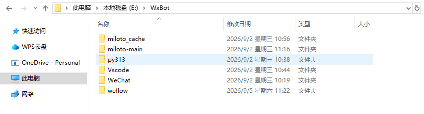{width="5.764583333333333in" height="1.5590277777777777in"}

## AstrBot

**配置方法：**

1.  **配置AI模型**
    左侧导航栏找到欢迎选项，点击进入快速引导界面
    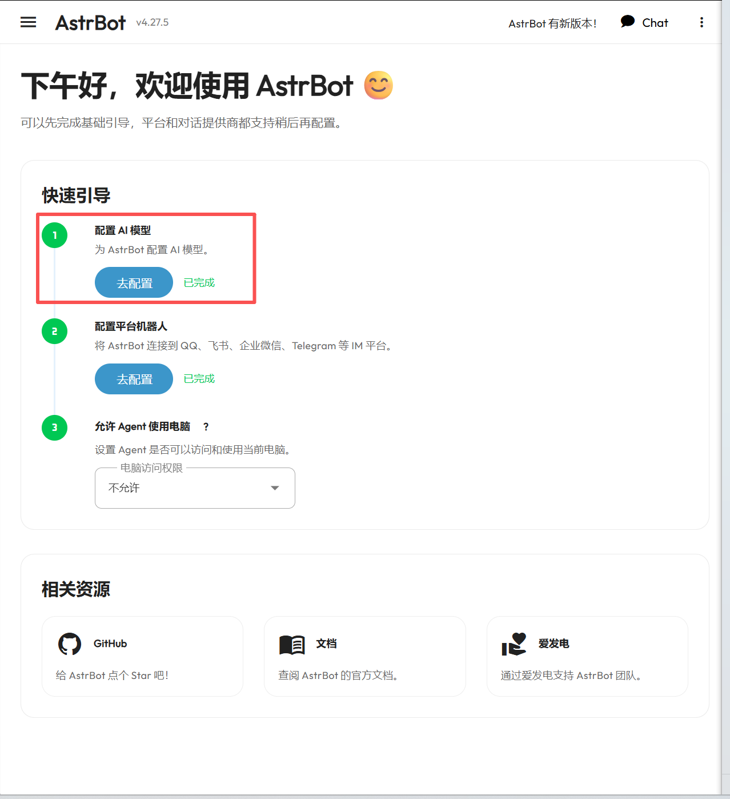{width="4.8875in" height="5.346527777777778in"}
    点击"去配置"，跳转页面后选择右上角新增按钮
    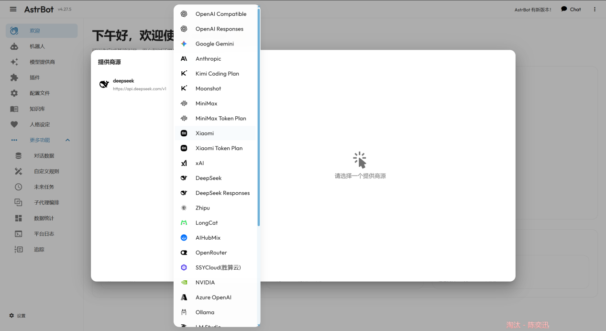{width="5.757638888888889in" height="3.1458333333333335in"}
    进行模型供应商的选择
    以DeepSeek为例填入对应的API 密钥后下滑并点击"保存并获取模型"
    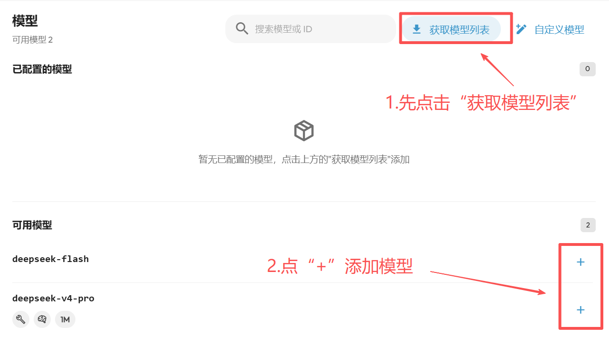{width="5.764583333333333in" height="3.2597222222222224in"}
    可自行选择模型配置（模型能力、请求体参数、模型上下文窗口)，配置完成后点击保存即可

2.  **创建机器人**
    点击"去配置"后，选择消息平台类别，这里一定要选择OneBot v11协议。
    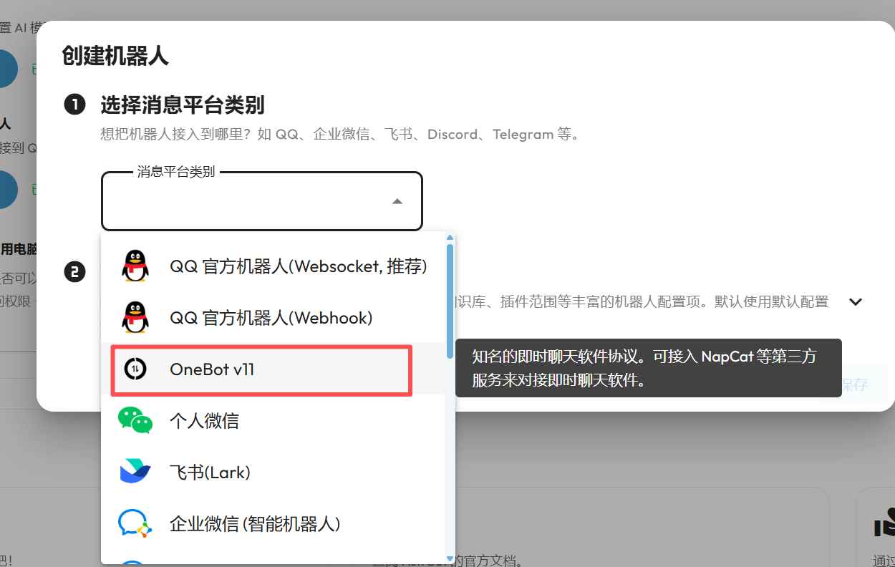{width="5.7555555555555555in" height="3.6465277777777776in"}
    选择好后直接保存即可

3.  **机器人配置**
    在左侧导航栏找到"配置文件"选项
    找到刚刚配置好的机器人，选择配置文件，默认为default

    (1) **AI配置**
        人格：既系统提示词，可在左侧导航栏的"人格设置"中进行增删改

    (2) **插件功能**
        可在左侧导航栏中点击"插件"，可在插件市场中寻找合适的插件
        目前使用的两个插件分别能实现调用RagFlow中的智能体与消除md格式
        其中调用RagFlow智能体插件是由astrbot_plugin_ragflow_adapter改进的，智能进行本地上传，具体操作步骤如下：

    1.  点击左侧导航栏"插件"后，页面的右下角会有一个"+"，点击进行安装

    2.  选择从文件安装
        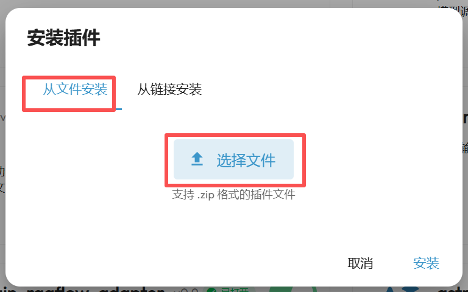{width="4.139583333333333in" height="2.1840277777777777in"}
        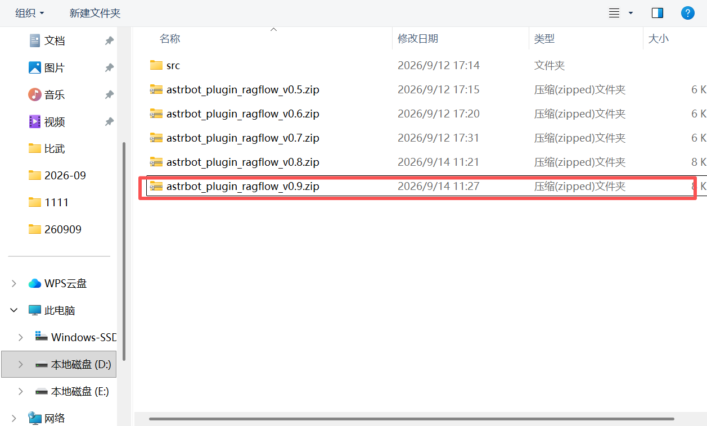{width="3.6909722222222223in" height="2.2256944444444446in"}
        选择包含源码的压缩包文件[[astrbot_plugin_ragflow_v0.9.zip]](astrbot_plugin_ragflow_adapter-main/astrbot_plugin_ragflow_v0.9.zip)

    3.  选择完成后点击安装（注：在安装前要先把之前安装的旧版本删掉再安装新版本）

    4.  插件配置
        选择设置按钮
        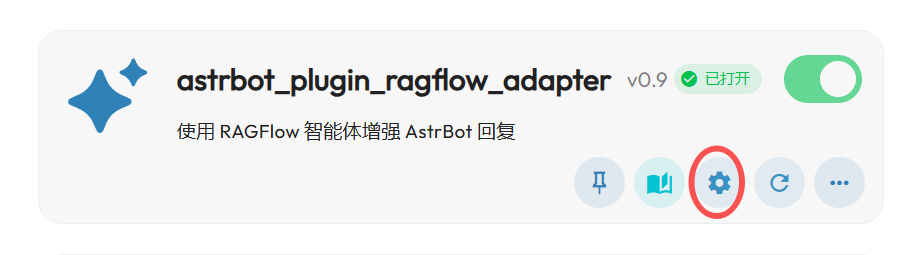{width="5.7659722222222225in" height="1.601388888888889in"}
        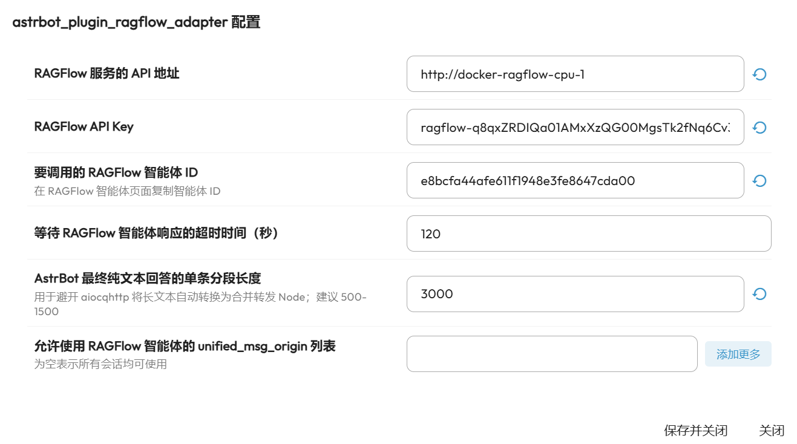{width="5.761805555555555in" height="3.2111111111111112in"}
        
        填入对应的API地址、API Key、智能体ID后点击"保存并关闭"

        --注：

        修改之后的插件已经发布到AstrBotCloud，可以在插件市场直接搜索"RagFlow智能体工作流"，配置方式同上
        
        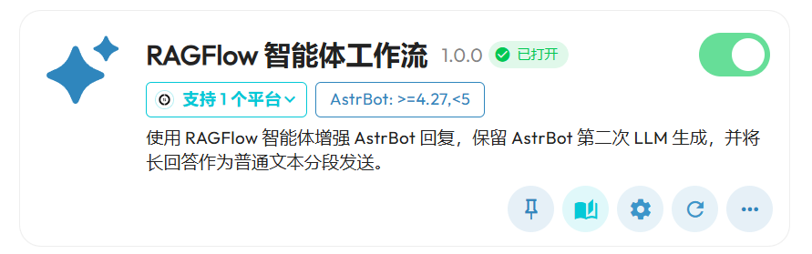{width="5.763888888888889in" height="1.804861111111111in"}
    
4.  **拓展功能**
    找到群聊上下文感知打开主动回复，并将回复概率拉满，这样机器人就能回复用户的每一句话
    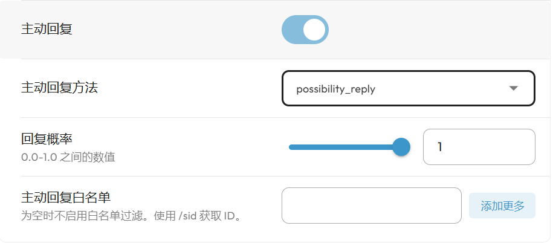{width="5.766666666666667in" height="2.533333333333333in"}

## WeFlow

下载地址：夸克网盘链接：[https://pan.quark.cn/s/127b67a9a0c8]{.underline} 提取码 jqFX
在配置WeFlow之前要提前登录需要当作机器人的微信号

1.  **设置API服务**
    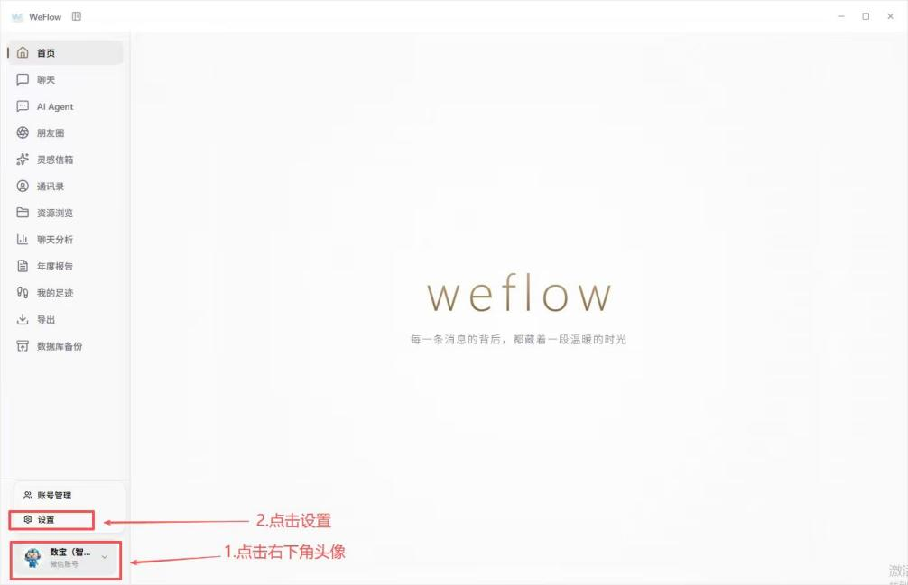{width="4.572222222222222in" height="2.9493055555555556in"}
    依次按照途中内容进行操作
    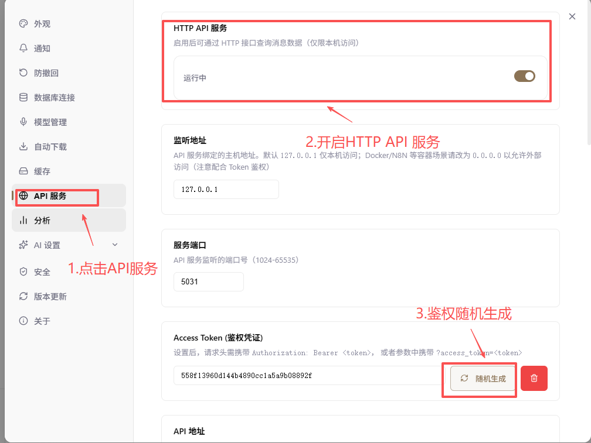{width="4.147916666666666in" height="3.1145833333333335in"}
    要提前保留好鉴权凭证，后续在miloto配置中会用到

2.  **推送白名单**
    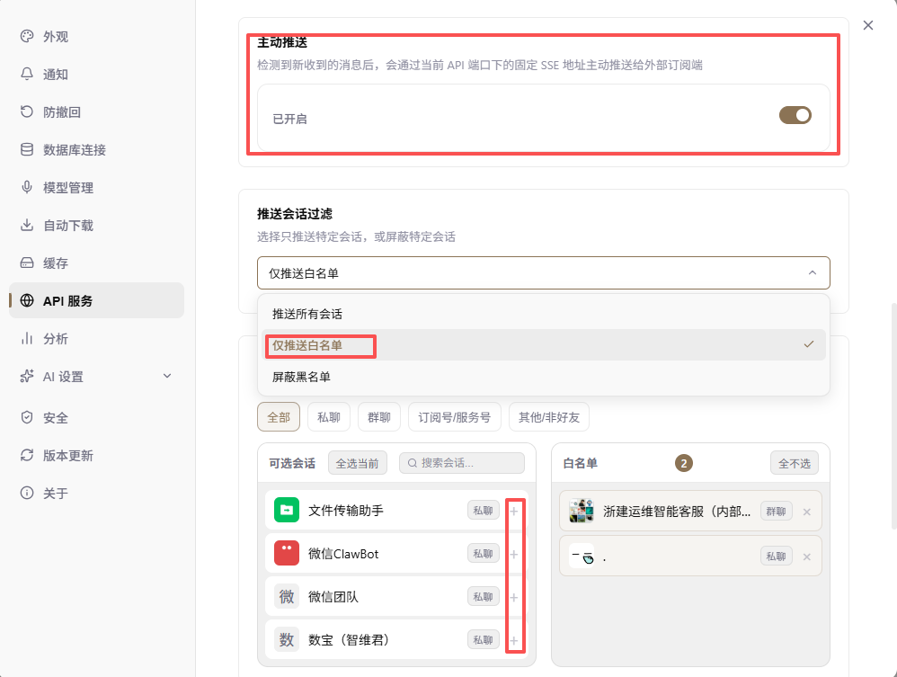{width="5.759027777777778in" height="4.345138888888889in"}

开启主动推送，并在推送会话过滤中选择"仅推送白名单"，在下方通过点击"+"来添加白名单，这样配置可以使客服机器人只针对特定的联系人进行消息的发送，避免其他群聊的污染

## Miloto

代码已经克隆到本地，只需要保持程序运行；

登录控制台后只需要在连接设置中配置WebSocket连接与WeFlow连接

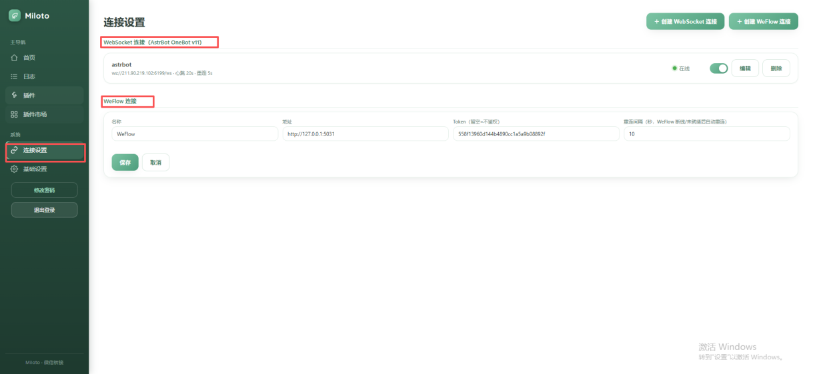{width="5.542361111111111in" height="2.5597222222222222in"}

在WeFlow连接中地址为[http://127.0.0.1:5031
](http://127.0.0.1:5031)端口号在WeFlow中查找：设置→API服务→服务端口
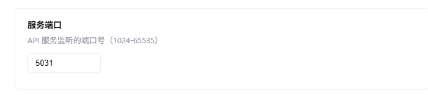{width="4.860416666666667in" height="1.0833333333333333in"}\
Token就是WeFlow中生成的鉴权凭证：设置→API服务→鉴权凭证
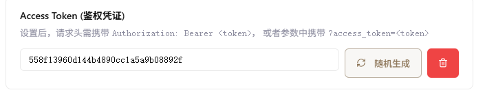{width="5.253472222222222in" height="1.125in"}

WebSocket的地址为ws://211.90.219.102:6199/ws
端口号在AstrBot中查找：机器人→找到对应的机器人实例→编辑→反向WebSocket接口
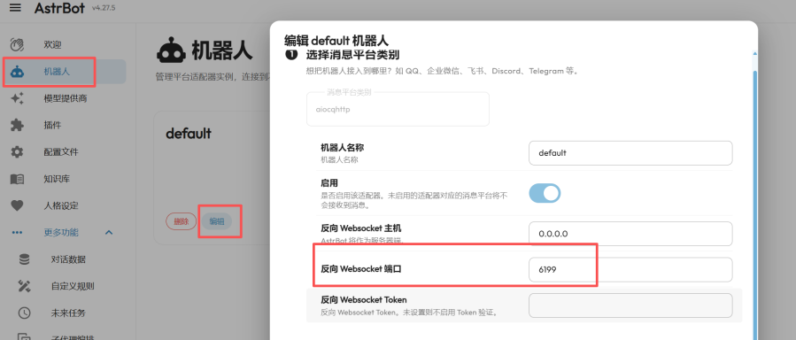{width="4.085416666666666in" height="1.7458333333333333in"}
